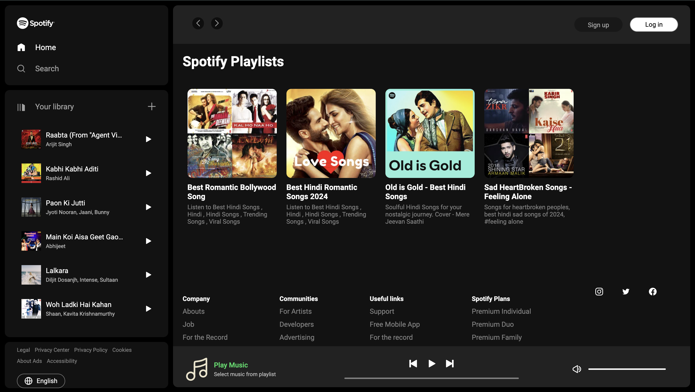

# Music Controller (Spotify Clone)

Welcome to the Music Controller project! This project is a Spotify-like music controller built using HTML, CSS, and JavaScript. It mimics some of the core functionalities of Spotify, allowing users to play music, control playback, and view playlists.

Live Preview Link : [Spotify-Clone](https://decoratora.in/spotify-clone/) : I have used a lite server , so it might take some time to load the images and audio files.

Screenshot

## Features

- Play/Pause music
- Next/Previous track
- Volume control
- Playlist navigation
- Dynamic UI updates

## Programming Languages Used

- HTML
- CSS
- JAVASCRIPT

## Project Structure

The project is structured as follow : 
- `index.html` : The main HTML file for the Spotify Clone.
- `new.js` : The JavaScript file for adding interactivity to the project.
- `style.css` : The CSS file containing styles for the project.
- `readme.md` : Provide brief description of the project.
- `assets` : Directory containing important data as follows :
  - `.htaccess` : A important hidden file , which need to be added within assets directory in order to give the live server access of the images, icons, audio etc.
  - `images` : Directory containing all the icons-svg used in the project.
  - `playlists` : Directory containing all the playlist
    - `audio` : Directory within each playlist folder to store the music(.mp3).
    - `songimg` : Directory within each playlist folder to store the song images.
    - `info.txt` : A text file containing playlist name and description.
    - `songname.txt` : A text file containing each playlist songs name.
    - `artistname.txt` : A text file containing each playlist songs artist name.
    - `img.png` : Playlist image

## Assets

All assets including playlist data, images, and icons are stored in the /assets folder. Each playlist contains an audio folder with a single music file due to GitHub's file size restrictions. So, upload it manually by downloading it from the internet.

## Contributing

Contributions are welcome! If you have any ideas, suggestions, or improvements, feel free to create a pull request or open an issue.

## Credits

- Icons and images from Spotify.
- Designed by Aman Derwal.
